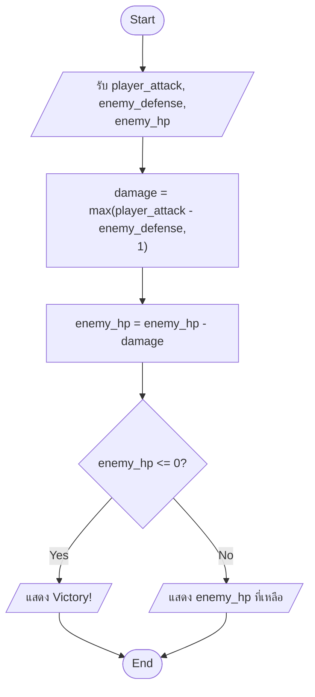
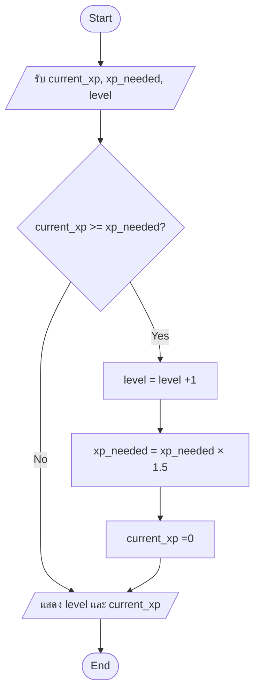

```mermaid
flowchart TD
Start([Start]) --> Input[/รับ player_attack, enemy_defense,
enemy_hp/]
Input --> Calc["damage = max(player_attack - enemy_defense,
1)"]
Calc --> Reduce["enemy_hp = enemy_hp - damage"]
Reduce --> D1{enemy_hp <= 0?}
D1 -->|Yes| Win[/แสดง Victory!/]
D1 -->|No| Show[/แสดง enemy_hp ที่เหลือ/]
Win & Show --> End([End])
```

```mermaid
flowchart TD
start([Start]) --> input[/รับ current_xp, xp_needed, level/]
input -->  A{ current_xp >= xp_needed?}
A --> |Yes| B[level = level +1 ]
A --> |No| Show[/แสดง level และ  current_xp/]
B --> C["xp_needed = xp_needed × 1.5 "]
C --> D["current_xp =0  "]
D --> Show[/แสดง level และ  current_xp/]
Show --> End([End])
```
